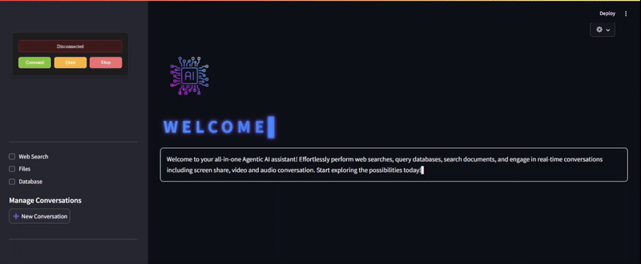
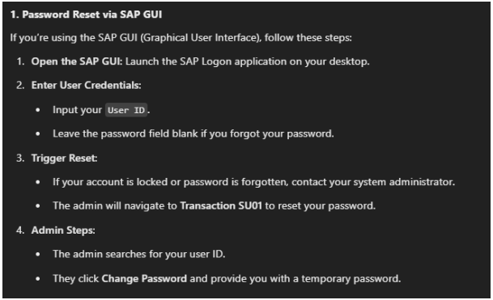
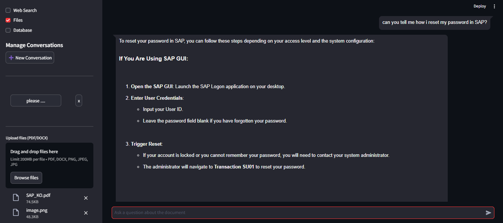
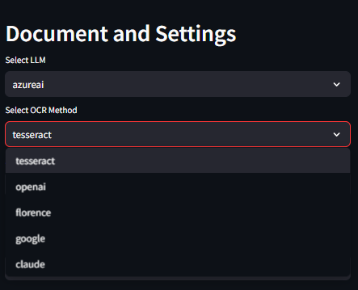
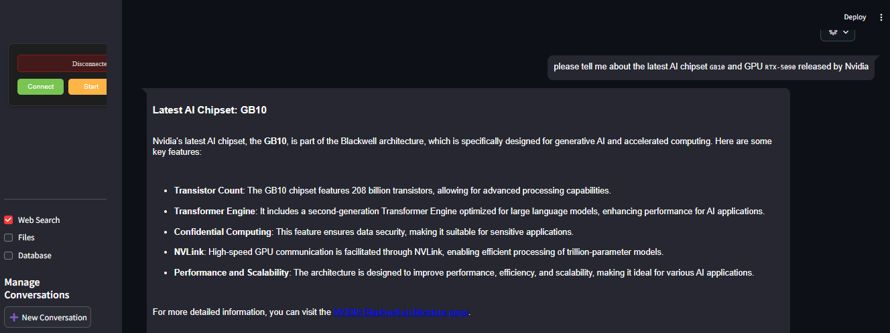
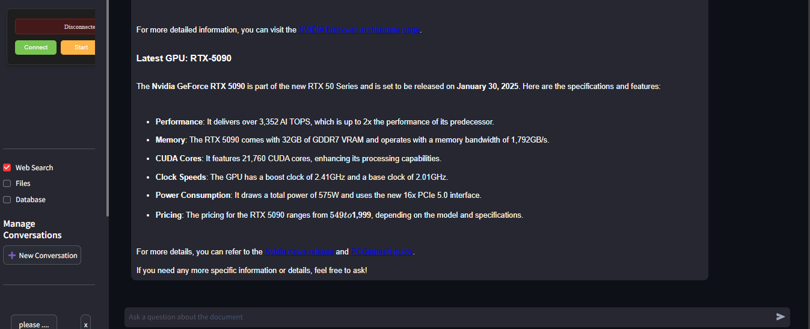
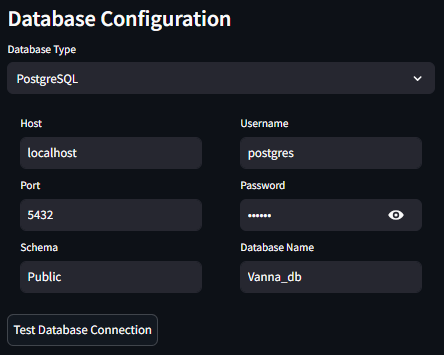
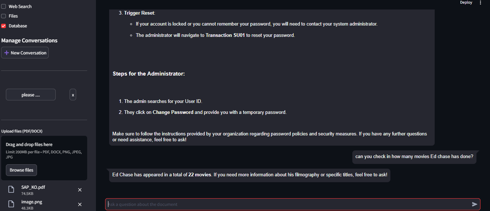

# OmniAgent
LangGraph-powered Agentic Chatbot enabling real-time conversations with Gemini, alongside document analysis, web search, and database querying in a sleek, intuitive interface

## Features
 

### 2. Document Analysis
- Upload and analyze PDF/DOCX files
- Supports file size up to 200MB
- Real-time document parsing

### 3. Model Selection
#### LLM Options:
- azureai
- gemini-2.0-flash-thinking-exp-1219
- gemini-2.0-flash-exp
- gemini-exp-1206
- claude3-sonnet
- qwen

#### OCR Methods:
- tesseract
- openai
- florence
- google
- claude

### 4. Web Search Integration
- Real-time web queries
- Current events and news updates
- Technical specifications lookup

### 5. Database Integration

## Technical Configuration

## DataBase Query
- PostgreSQL support
- Configurable database connection
- Custom schema support
- Secure credential management
- Interactive database querying

## Interaction with Gemini with screen share or video
<video src="OUTPUT/recording.mkv" width="400" controls>
Your browser does not support the video tag.
</video>

[Download the video](OUTPUT/recording.mkv)

